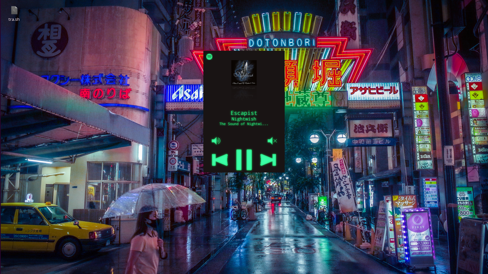

# aoede [(muse of voice and song)](https://en.wikipedia.org/wiki/Aoede_(mythology))

---

### A Spotify player/remote controller build for cheap, with a raspberry pi

---

### Hardware

Obviously you can use other things, because 99% of this is software, but
here are the things I used.

- Raspberry Pi Zero W
- [Audio DAC SHIM from Pimoroni](https://shop.pimoroni.com/products/audio-dac-shim-line-out)
- [3.5" 480x320 touchscreen](https://shop.pimoroni.com/products/pitft-plus-480x320-3-5-tft-touchscreen-for-raspberry-pi-pi-2-and-model-a-b), other screens will work too, but you'll have to edit the [layout](https://github.com/RazorSh4rk/aoede/tree/master/src/main/resources/layout) file (i recommend using [scene builder](https://gluonhq.com/products/scene-builder/))
- [a charging board (with protection), a 5v step-up converter](https://www.aliexpress.com/item/1005001935062751.html?spm=a2g0o.productlist.0.0.4b10b23bo7r8b0&algo_pvid=c4ecb587-4757-4204-8fd8-73cdaaa8765d&algo_exp_id=c4ecb587-4757-4204-8fd8-73cdaaa8765d-5) and a battery (I took a cell from an XPS13 battery pack)
- I used a [type-C socket board](https://www.aliexpress.com/item/1005002795893679.html?spm=a2g0o.productlist.0.0.5d221935hfGB12&algo_pvid=a689f38a-37cf-4a9a-a5ca-8ed87cdb8f23&algo_exp_id=a689f38a-37cf-4a9a-a5ca-8ed87cdb8f23-0), you won't need that if you buy a type-C charging board or are okay with using m*cro usb
- [tactile buttons](https://www.aliexpress.com/item/32960657626.html?spm=a2g0o.productlist.0.0.7a151fcdiCzA8J&algo_pvid=81628589-63e1-4100-897b-3eba8535b5d2&aem_p4p_detail=202109020350405244601925287200000412760&algo_exp_id=81628589-63e1-4100-897b-3eba8535b5d2-14)
- [on-off switch](https://www.aliexpress.com/item/4001207529493.html?spm=a2g0o.productlist.0.0.1729678c5yzRVx&algo_pvid=166cc160-bbab-4233-a5c5-40ef9f008858&algo_exp_id=166cc160-bbab-4233-a5c5-40ef9f008858-40)
- a piece of perfboard, soldering iron, solder, 3d printed parts, microsd card, wires, etc.

I left links for bulk stuff, obviously buy them as you see fit.

---

### Software setup

I use ScalaFX, ScalaFXML and Undertow for the app, big thanks to the maintainers. You will only need a Java8 (and up) runtime.

- Register a Spotify account
- Pay for premium :)))
- Go to the [https://developer.spotify.com/dashboard/login](developer dashboard)
- Create an app
- Plug `client-id` and `client-secret` into your `application.properties` file
- Add a redirect URL in the dashboard, and plug it into the file. If you want automated setup, leave `local-server` on true and use `http://localhost:9001/` (it's over 9k), but you have no idea if my code is stealing your credentials (it's not). You can also use `http://144.202.12.141:9005` but I can't guarantee that I won't forget to pay Vultr for the VPS. Alternatively, `pip install flask && python app.py` to run a local server.

I recommend you do these steps on your computer, and just copy over the config later. If you use the automated setup, you will be prompted to log in to your account in the browser of your choice, i recommend setting it up on your pi with a keyboard at least once (or use VNC).

---

- Install headless raspbian on your sd card (you don't need any of the extra software)
- Add the networks you will use to the wpa-supplicant.conf file
- Enable SSH
- [Detailed tutorial for previous steps](https://www.factoryforward.com/raspberry-pi-headless-wifi-setup/)
- ssh into your pi (`ssh pi@raspberrypi.local`) password: `pi`
- **I will add a setup script later**
- Get your application.properties file near the .jar file on the pi (`cat application.properties.template | nc termbin.com 9999 | xclip -i` then `curl *middle click* > application.properties`)
- Add `java -jar spotify.jar` to startup
